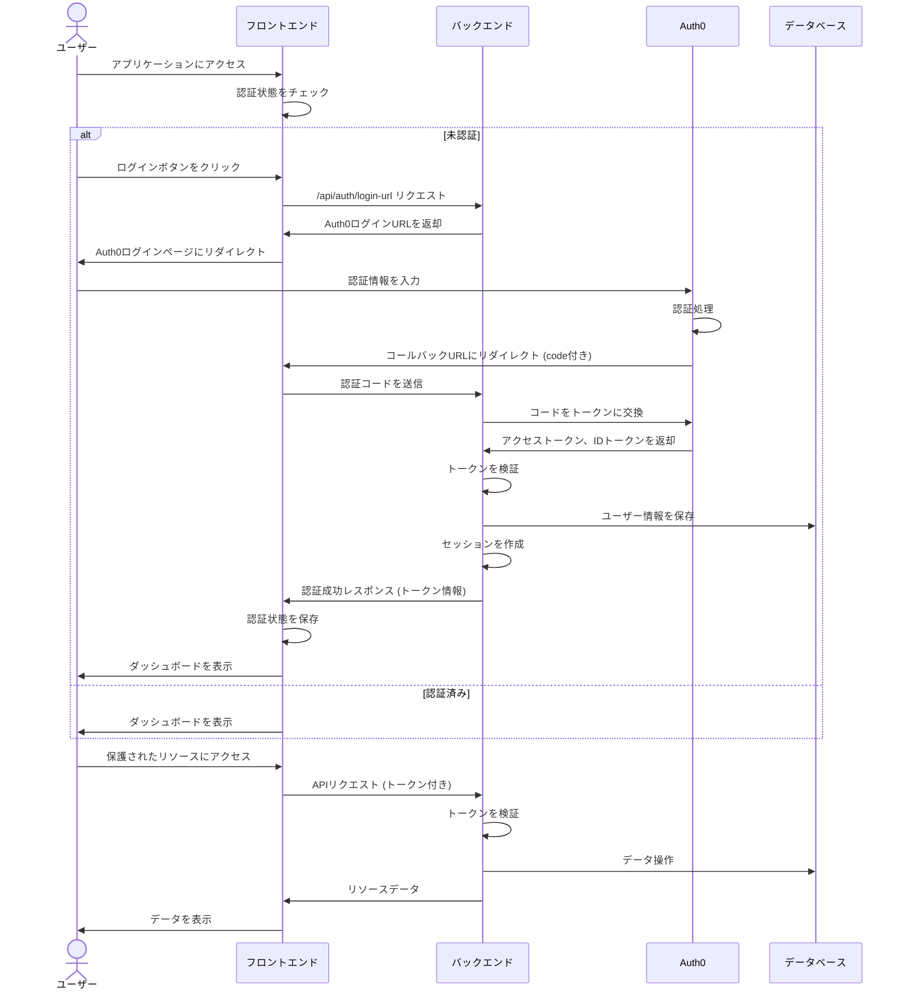

# 認証フロー

## 概要

このアプリケーションでは、Auth0を利用した認証システムを実装しています。認証フローはOAuth 2.0のAuthorization Codeフローに基づいており、セキュアな認証と豊富な機能を提供します。

## 認証フローのシーケンス図

## 認証フローの詳細説明

### 1. 初期アクセスとログイン

1. ユーザーがアプリケーションにアクセスすると、フロントエンドはローカルストレージを確認して認証状態を判断します。
2. 未認証の場合、ユーザーはログインボタンを表示されます。
3. ユーザーがログインボタンをクリックすると、フロントエンドはバックエンドの `/api/auth/login-url` エンドポイントにリクエストを送信します。
4. バックエンドは Auth0 の認証 URL を生成して返却します。
5. フロントエンドはユーザーを Auth0 のログインページにリダイレクトします。

### 2. Auth0 での認証

1. ユーザーは Auth0 のログインページで認証情報を入力します。
2. Auth0 は認証処理を行い、成功した場合はアプリケーションのコールバック URL にリダイレクトします。このとき、URL には認証コード（code）が含まれています。

### 3. 認証後の処理

1. フロントエンドはコールバックを受け取り、URL から認証コードを抽出します。
2. 抽出した認証コードをバックエンドに送信します。
3. バックエンドは認証コードを使用して Auth0 にアクセストークンとIDトークンをリクエストします。
4. Auth0 はトークンを返却します。
5. バックエンドはトークンを検証し、ユーザー情報を抽出します。
6. ユーザー情報をデータベースに保存し、セッションを作成します。
7. バックエンドはトークン情報（アクセストークン、IDトークン、有効期限など）をフロントエンドに返却します。
8. フロントエンドはトークン情報をローカルストレージに保存し、認証状態を更新します。
9. ユーザーはダッシュボードまたはホームページにリダイレクトされます。

### 4. 認証済みユーザーのアクセス

1. 認証済みユーザーがアプリケーションにアクセスすると、フロントエンドはローカルストレージから認証情報を取得します。
2. 保護されたリソースへのアクセス時、フロントエンドはアクセストークンをヘッダーに含めてバックエンドにリクエストを送信します。
3. バックエンドはトークンを検証し、有効であれば要求されたリソースを返却します。
4. トークンが無効または期限切れの場合、バックエンドは401エラーを返し、フロントエンドはユーザーを再認証のためにログインフローに誘導します。

### 5. ログアウト処理

1. ユーザーがログアウトボタンをクリックすると、フロントエンドはローカルストレージから認証情報を削除します。
2. バックエンドに対してセッションを無効化するリクエストを送信します。
3. バックエンドはセッションを無効化し、ユーザーは未認証状態になります。

## セキュリティ対策

- **トークン保管**: トークンはローカルストレージに保存され、HTTPヘッダーを通じて送信されます。
- **セッション管理**: サーバーサイドセッションを使用して、セッションハイジャックを防止します。
- **アクセス制御**: バックエンドAPIは認証トークンを検証し、権限に基づいてアクセスを制御します。
- **HTTPS**: すべての通信はHTTPSで暗号化されます。
- **CSRF対策**: Spring Securityによる自動的なCSRF対策が実装されています。
- **セッションタイムアウト**: 30分のセッションタイムアウトが設定されています。 