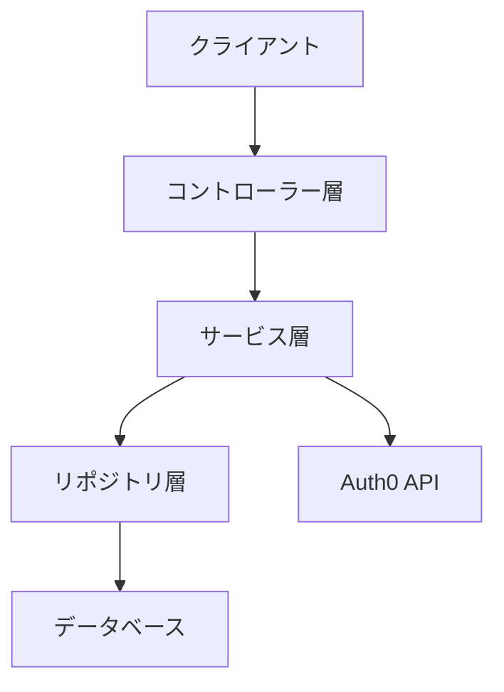

# バックエンド設計

## 概要

バックエンドはSpring Bootフレームワークを使用したRESTful APIとして実装されています。Kotlinを採用することで、タイプセーフで簡潔なコードを実現しています。データの永続化にはMySQLを使用し、Spring Data JPAを介してORMを活用しています。

## アーキテクチャ

バックエンドは以下のアーキテクチャ原則に基づいて設計されています：

1. **レイヤードアーキテクチャ**: コントローラー、サービス、リポジトリの明確な分離
2. **依存性の注入**: コンポーネント間の疎結合の実現
3. **RESTful API設計**: リソース指向のエンドポイント設計
4. **トークンベースの認証**: Auth0を使用したOAuth2.0/OIDC認証
5. **サーバーサイドセッション**: JDBCベースのセッション管理

## アーキテクチャ図



## レイヤー構造

### コントローラー層 (Controllers)
- クライアントからのHTTPリクエストを処理
- 入力のバリデーション
- レスポンスの形成
- 認証とアクセス制御

### サービス層 (Services)
- ビジネスロジックの実装
- トランザクション管理
- データの変換と集約

### リポジトリ層 (Repositories)
- データアクセスロジック
- JPAエンティティの管理
- クエリの実行

## データモデル

主要なエンティティは以下の通りです：

### User
```
- id: Long (PK)
- email: String
- name: String
- auth0Id: String
- createdAt: Timestamp
- updatedAt: Timestamp
```

### Message
```
- id: Long (PK)
- content: String
- userId: Long (FK to User)
- createdAt: Timestamp
```

### SPRING_SESSION (Spring Session JDBC)
```
- PRIMARY_ID: String (PK)
- SESSION_ID: String
- CREATION_TIME: Long
- LAST_ACCESS_TIME: Long
- MAX_INACTIVE_INTERVAL: Integer
- EXPIRY_TIME: Long
- PRINCIPAL_NAME: String
```

### SPRING_SESSION_ATTRIBUTES
```
- SESSION_PRIMARY_ID: String (PK, FK to SPRING_SESSION)
- ATTRIBUTE_NAME: String (PK)
- ATTRIBUTE_BYTES: Blob
```

## 主要API エンドポイント

| エンドポイント | メソッド | 説明 | 認証 |
|--------------|--------|------|-----|
| `/api/auth/login-url` | GET | Auth0ログインURLを取得 | 不要 |
| `/api/auth/callback` | POST | 認証コードを処理 | 不要 |
| `/api/auth/logout` | POST | ユーザーをログアウト | 必要 |
| `/api/message` | GET | ユーザーメッセージを取得 | 必要 |
| `/api/user/profile` | GET | ユーザープロフィールを取得 | 必要 |

## 認証・認可フロー

1. クライアントが`/api/auth/login-url`にアクセスしてAuth0のログインURLを取得
2. ユーザーがAuth0で認証し、コールバックURLにリダイレクト
3. クライアントが認証コードを`/api/auth/callback`に送信
4. バックエンドがコードをトークンに交換し、ユーザー情報を検証
5. ユーザー情報をデータベースに保存し、セッションを作成
6. アクセストークンとセッションIDをクライアントに返却
7. 以降のリクエストはBearer認証ヘッダーでトークンを送信

## セッション管理

- Spring Session JDBCを使用してセッションをデータベースに保存
- セッションタイムアウトは30分に設定
- セッションの一意性はJSESSIONIDクッキーで保証

## セキュリティ

バックエンドは以下のセキュリティ対策を実装しています：

1. **JWT検証**: Auth0から取得したトークンの署名と有効期限を検証
2. **認可**: エンドポイントごとの認証要件の適用
3. **CSRF対策**: Spring SecurityによるCSRFトークン
4. **セキュアクッキー**: HttpOnlyとSecureフラグを設定
5. **レート制限**: 過剰なリクエストを防止

## エラーハンドリング

バックエンドは以下のエラーハンドリング戦略を実装しています：

1. **グローバル例外ハンドラー**: アプリケーション全体で一貫したエラーレスポンス
2. **HTTPステータスコード**: 適切なHTTPステータスコードの使用
3. **詳細なエラーメッセージ**: クライアントが対応できる詳細なエラー情報

## パフォーマンス最適化

- キャッシング: メモリ内キャッシュを使用
- コネクションプーリング: データベース接続の効率的な管理
- 非同期処理: 長時間実行タスクの非同期処理

## 非同期処理

アプリケーションは以下の非同期処理機能を実装しています：

### 英単語翻訳処理

- **目的**: ユーザーが登録した英単語の意味と例文を自動生成する
- **技術スタック**: Spring Batch, Redis, OpenAI API
- **処理フロー**:
  1. 単語登録時にステータスを「PENDING」として保存
  2. スケジュールされたバッチジョブ（2分間隔）が未処理の単語を検出
  3. OpenAI APIを使用して単語の意味と例文を生成
  4. 処理結果をデータベースに保存（ステータス: COMPLETED / ERROR）

- **エラー処理**:
  - レート制限（HTTP 429）に対するバックオフ戦略とリトライ
  - 最大リトライ回数（3回）後のエラー状態への遷移
  - APIリクエスト間の適切な待機時間（3秒）

- **モデル**: 
```kotlin
enum class TranslationStatus {
    PENDING, COMPLETED, ERROR
}
```

詳細は [ADR-004: 非同期翻訳処理の実装](./adr/ADR-004-Async-Translation.md) を参照してください。

## ロギング

- 構造化ロギング: JSON形式のログ
- ログレベル: INFO（本番環境）、DEBUG（開発環境）
- 主要なログポイント: リクエスト開始/終了、認証イベント、エラー 