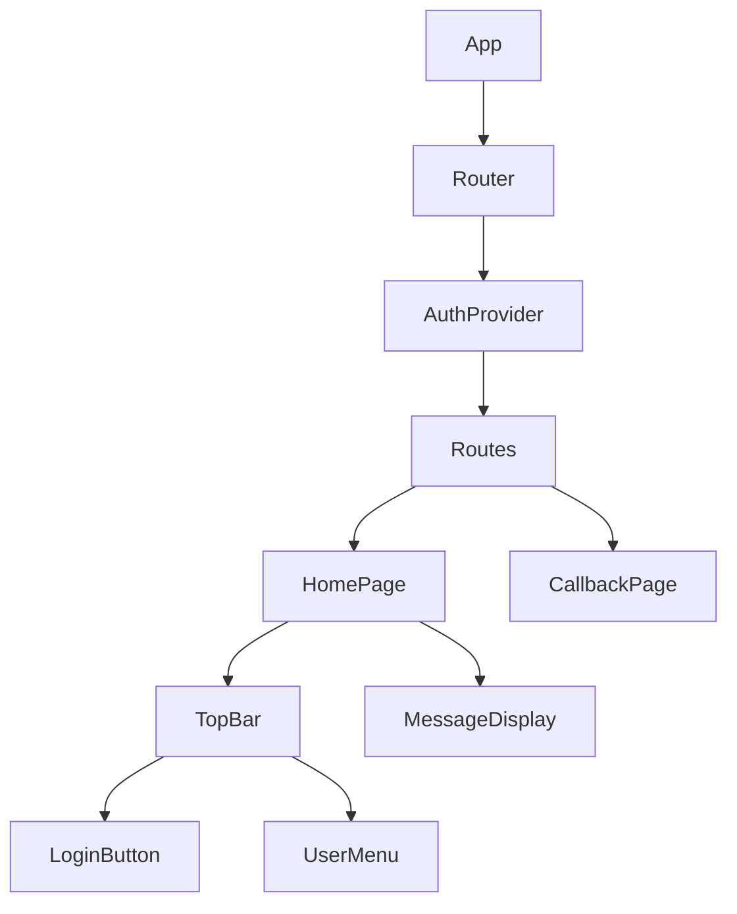

# フロントエンド設計

## 概要

フロントエンドはReactを使用した単一ページアプリケーション（SPA）として実装されています。TypeScriptを採用することで型安全性を高め、開発効率と保守性を向上させています。

## アーキテクチャ

フロントエンドは以下の原則に基づいて設計されています：

1. **コンポーネントベース設計**: 再利用可能なUIコンポーネントを構築
2. **関心の分離**: ビジネスロジックとUIを分離
3. **コンテキストによる状態管理**: 認証状態などの共有状態はReact Context APIで管理
4. **宣言的UI**: 命令型ではなく宣言的なUIの構築
5. **レスポンシブデザイン**: さまざまな画面サイズに対応

## コンポーネント階層図



## 主要コンポーネント

### App.tsx
アプリケーションのルートコンポーネント。AuthProviderとRouterを初期化します。

### AuthProvider
認証状態を管理するContextProvider。ログイン、ログアウト機能と認証状態の永続化を提供します。

### TopBar
ページ上部に表示されるナビゲーションバー。サイトのタイトルとログイン/ユーザー情報を表示します。

### LoginButton
未認証ユーザー向けのログインボタン。クリック時にAuth0認証フローを開始します。

### HomePage
アプリケーションのメインページ。認証状態に応じて異なるコンテンツを表示します。

### CallbackPage
Auth0からのコールバックを処理するページ。認証コードを取得しバックエンドと連携します。

## ディレクトリ構造

```
frontend/
├── public/              # 静的ファイル
├── src/                 # ソースコード
│   ├── components/      # 再利用可能なUIコンポーネント
│   │   ├── LoginButton.tsx
│   │   ├── TopBar.tsx
│   │   └── ...
│   ├── context/         # Reactコンテキスト
│   │   └── AuthContext.tsx
│   ├── pages/           # ページコンポーネント
│   │   ├── HomePage.tsx
│   │   ├── CallbackPage.tsx
│   │   └── ...
│   ├── services/        # APIサービス
│   ├── types/           # TypeScript型定義
│   ├── utils/           # ユーティリティ関数
│   ├── App.css          # グローバルスタイル
│   ├── App.tsx          # ルートコンポーネント
│   └── index.tsx        # エントリーポイント
├── package.json         # 依存関係と設定
└── tsconfig.json        # TypeScriptの設定
```

## 状態管理

アプリケーションの状態は主に以下の方法で管理されています：

1. **ローカル状態**: コンポーネント固有の状態はReactの`useState`フックを使用
2. **共有状態**: アプリ全体で共有される状態（認証情報など）は`useContext`で管理
3. **永続化**: 認証状態はlocalStorageを使用して永続化

## スタイリング

アプリケーションのスタイリングは以下の方針で実装されています：

1. **標準CSS**: コンポーネントのスタイルは標準CSSを使用
2. **レスポンシブデザイン**: メディアクエリを使用して複数のデバイスサイズに対応
3. **モバイルファースト**: モバイル向けに最適化してからデスクトップに拡張

## レスポンシブデザイン

アプリケーションは以下のブレークポイントでレスポンシブデザインを実装しています：

- モバイル: ~767px
- タブレット: 768px~1023px
- デスクトップ: 1024px~

## パフォーマンス最適化

- 遅延ローディング（React.lazy）によるコード分割
- メモ化（React.memo, useMemo, useCallback）による不要な再レンダリングの防止
- 適切なキーの使用によるリスト更新の最適化 